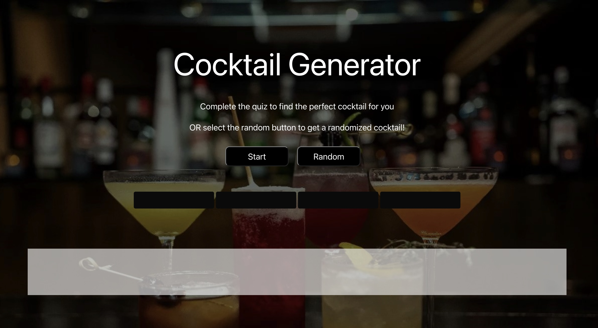

# Cocktail Generator

## Description

This application is a cocktail quiz to find a cocktail of choice based on the answers the user picks. There is an API that has a stored list of cocktails that this application pulls from. When a cocktail is chosen, a GIF will pop up as well which is also being pulled from Giphy API that stores GIFs. Bulma CSS framework was used to create the options buttons on the quiz.This is a collaborative project to create an application that solves a real-world problem requiring continuous communication and teamwork between students. Learning how to incorporate API's into a code and collaboriating with multiple people is good practice for jobs after bootcamp.

## User Story

As a student in the Washington University Full-Stack Bootcamp, I need to find the perfect drink after completing Project #1. I want a website that will provide a fun and interactive experience that will help me find my cocktail of choice.

## Installation

N/A

## Usage

When the user goes to the application, they are presented with a quiz to help the user figure out which cocktail may be right for them. Once they press the start button, the questions with multiple options will pop up for the user to answer. The user will be shown a cocktail based on the answers they have picked along with a GIF. If the user does not want to answer any questions, they can click on the random button to get any random cocktail from our API. 

## Deployment Link

https://mkickham.github.io/CocktailGif/ 

## Credits

Webpage by: Michael Kickham, Zach Elbring, Alysa Evans, Sarah Padilla
Institution: WashU in St. Louis
Course: Bootcamp Full Stack Development
Instructors: Brett Gaynor, Chris Pesar

## License

Please refer to LICENSE in the repository.